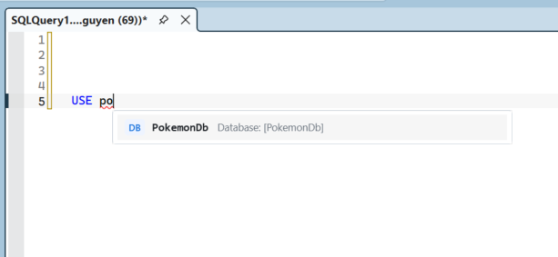
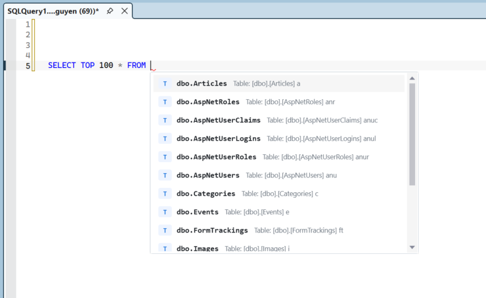
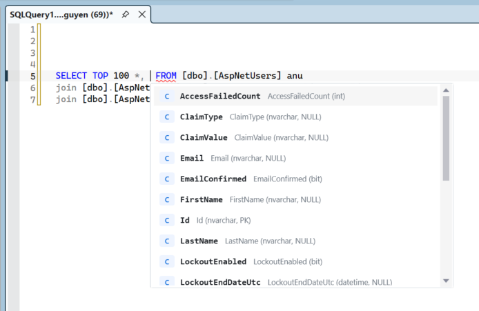
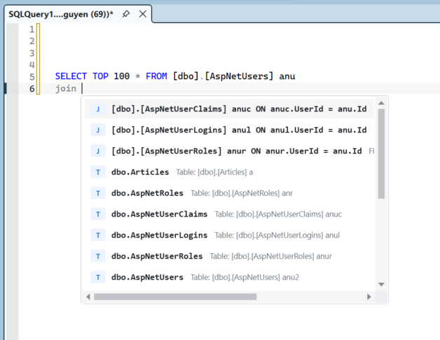
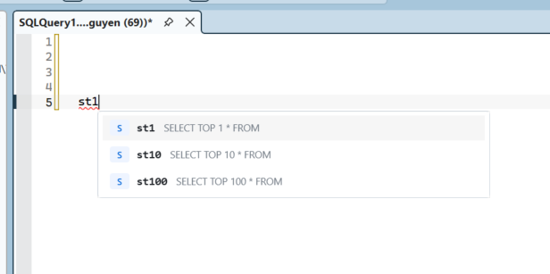

# OpenHint SQL

OpenHint SQL is an open-source SQL autocomplete and syntax suggestion extension designed to help developers write queries faster.

Provides instant, context-aware suggestions for databases, tables, columns, stored procedures, and T-SQL keywords — with foreign-key-driven JOIN suggestions and a library of snippet shortcuts that expand on Tab.

---

## Features

- **Context-aware autocomplete** — tables and views after `FROM`/`JOIN`; columns after `SELECT`, `WHERE`, `ORDER BY`, `GROUP BY`; stored procedures after `EXEC`
- **Database autocomplete** — after `USE `, suggests databases visible to the active login on the current server
- **Bracket-safe insertions** — tables/views insert as `[schema].[object]`; databases insert as `[database]`
- **FK-aware JOIN suggestions** — when a `FROM` table is in scope, typing `JOIN` surfaces related tables with the full `ON` clause pre-built from the actual foreign key (e.g. `Orders o ON o.CustomerId = c.Id`)
- **Dot completion** — `alias.` immediately lists that table's columns with data type and PK/NULL labels
- **40+ snippet shortcuts** — type a short code, press `Tab`, get a full statement with the cursor placed at the right position
- **Persistent schema cache** — schema loads once per database and writes to disk; subsequent SSMS restarts load from cache instantly without re-querying the server (24-hour TTL; can be disabled)
- **Eager preload** — schema fetch starts in the background the moment a query window opens, so the popup is ready before you need it
- **SSMS-style popup** — custom WPF completion list; keyboard-navigable (↑/↓ to move, Tab/Enter to accept, Esc to dismiss)
- **Native IntelliSense suppression** — while OpenHint SQL's popup is visible, the default SSMS completion popup is dismissed to avoid overlapping suggestion lists
- **Non-intrusive** — installs to its own `Extensions\OpenHintSQL` subfolder; never modifies SSMS core files; complete uninstaller included

---

## Demo

### Suggest databases



### Suggest tables



### Suggest columns



### Suggest JOINs by related foreign keys



### Suggest snippets



---

## Supported SSMS versions

OpenHint SQL targets SSMS 18 through SSMS 22.

| SSMS version | Architecture | Support status |
|---|---:|---|
| 18.x | 32-bit | Supported; smoke-tested on SSMS 18 |
| 19.x | 32-bit | Supported by VSIX manifest and install script |
| 20.x | 32-bit | Supported; smoke-tested on SSMS 20 |
| 21.x | 64-bit | Supported by VSIX manifest and install script |
| 22.x | 64-bit | Supported; smoke-tested on SSMS 22 |

The installer and source-install script auto-detect installed SSMS 18/19/20/21/22 instances and install into every detected version in one pass. SSMS 18-20 use the 32-bit VS isolated shell; SSMS 21-22 use the 64-bit VS 2022 shell.

---

## Installation

### Option A — Installer (recommended)

1. Download `OpenHintSQLSetup-1.0.0.exe` from the [v1.0.0 release](https://github.com/Jarvis81/OpenHint-SQL/releases/tag/v1.0.0).
2. Close all open SSMS windows.
3. Run the installer **as Administrator**. It detects your SSMS installations, confirms with you, copies the extension files, and clears the SSMS caches automatically.
4. Open SSMS and start typing in a query window.

**Verify it loaded:** View → Output → select **OpenHint SQL** from the dropdown.

### Option B — Build and install from source

**Prerequisites:** .NET SDK 6+, .NET Framework 4.8, at least one SSMS installation.

```cmd
git clone https://github.com/Jarvis81/OpenHint-SQL
cd OpenHint-SQL

dotnet build src\OpenHintSQL\OpenHintSQL.csproj -c Release

REM Install to all detected SSMS versions (run as Administrator)
scripts\install.bat

REM Install to a specific version only
scripts\install.bat 20
```

Maintainer packaging utilities live under `scripts\` to keep the repository root focused on source, docs, and solution files. To build the release installer, install Inno Setup 6 at its default location or make `ISCC.exe` available on `PATH`, then run:

```cmd
scripts\build-installer.bat
```

The installer is written to `dist\OpenHintSQLSetup-1.0.0.exe`. The `dist\` folder is intentionally ignored by Git, so generated installers do not show up as source files.

---

## Usage

### Autocomplete

The popup opens automatically as you type. Navigation: `↑`/`↓` to move, `Tab` or `Enter` to accept, `Esc` to dismiss.

| What you type | What the popup shows |
|---|---|
| After `FROM ` or `JOIN ` | All tables and views |
| After `JOIN ` when a FROM table is in scope | FK-related tables at the top with full `ON` clause |
| After `SELECT `, `WHERE `, `ORDER BY `, `GROUP BY ` | Columns of tables already referenced in the query |
| After `alias.` | Columns of the resolved table |
| After `EXEC ` | Stored procedures and functions |
| After `USE ` | Databases visible on the active server |
| Anywhere else | T-SQL keywords, functions, and snippet shortcuts |

Accepting a table or view inserts the fully qualified bracketed name, for example `[Sales].[Orders]`. In `FROM` and `JOIN` positions, OpenHint SQL also appends a short alias such as `[Sales].[Orders] o` so later column and JOIN suggestions can use the alias immediately. Accepting a database after `USE ` inserts `[DatabaseName]`.

On first use after opening SSMS, schema metadata loads from the disk cache (instant) or fetches live from the server in the background. Database-name suggestions are cached in memory per server connection. The popup refreshes automatically when loading completes.

### Snippets

Type the shortcut and press `Tab` to expand. `$cursor$` marks where the caret lands after expansion.

#### DML

| Shortcut | Expands to |
|---|---|
| `ssf` | `SELECT * FROM ` |
| `st100` | `SELECT TOP 100 * FROM ` |
| `st10` | `SELECT TOP 10 * FROM ` |
| `st1` | `SELECT TOP 1 * FROM ` |
| `sf` | `SELECT $columns$ FROM ` |
| `s` | `SELECT ` |
| `del` | `DELETE FROM $table$ WHERE ` |
| `ut` | `UPDATE $table$ SET $column$ = $value$ WHERE ` |
| `iit` | `INSERT INTO $table$ ($columns$) VALUES (...)` |
| `ii` | `INSERT INTO $target$ SELECT $columns$ FROM ` |
| `mg` | Full `MERGE INTO ... USING ... ON ...` statement |
| `pv` | `PIVOT` query template |

#### JOINs

| Shortcut | Expands to |
|---|---|
| `jn` | `INNER JOIN $table$ ON ` |
| `lj` | `LEFT JOIN $table$ ON ` |
| `rj` | `RIGHT JOIN $table$ ON ` |
| `cj` | `CROSS JOIN ` |
| `fj` | `FULL OUTER JOIN $table$ ON ` |

#### Filtering / grouping

| Shortcut | Expands to |
|---|---|
| `wh` | `WHERE ` |
| `ob` | `ORDER BY ` |
| `gb` | `GROUP BY ` |
| `hv` | `HAVING ` |
| `ex` | `EXISTS (SELECT 1 FROM $table$ WHERE ...)` |
| `nex` | `NOT EXISTS (SELECT 1 FROM $table$ WHERE ...)` |
| `cc` | `CASE WHEN ... THEN ... ELSE ... END` |

#### DDL

| Shortcut | Expands to |
|---|---|
| `ct` | `CREATE TABLE $schema$.[$name$] (...)` |
| `at` | `ALTER TABLE $table$ ADD $columnName$ $dataType$` |
| `dt` | `DROP TABLE IF EXISTS ` |
| `cv` | `CREATE VIEW ...` |
| `ci` | `CREATE NONCLUSTERED INDEX ...` |
| `cp` | `CREATE PROCEDURE ...` skeleton |
| `ap` | `ALTER PROCEDURE ...` skeleton |

#### Control flow

| Shortcut | Expands to |
|---|---|
| `iff` | `IF ... BEGIN ... END` |
| `ife` | `IF ... BEGIN ... END ELSE BEGIN ... END` |
| `wl` | `WHILE ... BEGIN ... END` |
| `bgn` | `BEGIN ... END` |
| `bgt` | `BEGIN TRANSACTION ... COMMIT TRANSACTION` |
| `btry` | `BEGIN TRY ... END TRY BEGIN CATCH ... END CATCH` |

#### Variables / temp tables / CTEs

| Shortcut | Expands to |
|---|---|
| `dv` | `DECLARE @$name$ $dataType$ = ` |
| `dvt` | `DECLARE @$name$ TABLE (...)` |
| `tmp` | Drop-if-exists + `CREATE TABLE #$name$ (...)` |
| `sinto` | `SELECT $columns$ INTO #$tmp$ FROM ` |
| `cte` | `WITH $name$ AS (...) SELECT * FROM $name$` |
| `rcte` | Recursive CTE with `UNION ALL` and `OPTION (MAXRECURSION 100)` |

### Adding custom snippets

Edit `Config\snippets.json` in the extension directory (or in `src\OpenHintSQL\Config\snippets.json` before building). Restart SSMS to pick up changes.

```json
{
  "snippets": [
    {
      "shortcut": "mysnip",
      "title": "My custom snippet",
      "expansion": "SELECT $columns$ FROM $cursor$",
      "description": "Custom select"
    }
  ]
}
```

---

## Privacy and security

OpenHint SQL runs entirely inside SSMS on your machine. It does not send telemetry, query text, schema names, connection details, or credentials to any external service.

The extension reads the active SSMS query-window connection and uses normal SQL metadata queries:

- `sys.objects`, `sys.columns`, `sys.types`, `sys.indexes`, and `sys.foreign_keys` for table/column/procedure/JOIN metadata
- `sys.databases` for `USE` database suggestions

Connection strings are only used locally to query metadata. Cache keys hash connection identity after password fields are removed, so credentials are not written to logs or cache filenames.

By default, OpenHint SQL writes only minimal status messages to the SSMS **Output** pane and does not write a persistent log file. Verbose diagnostics are opt-in:

```cmd
setx OPENHINTSQL_DEBUG 1
setx OPENHINTSQL_FILE_LOG 1
```

Restart SSMS after changing these flags. Diagnostic logs may include local server names, database names, typed completion prefixes, and object names, so only enable them when troubleshooting.

Schema disk cache is enabled by default for performance and is stored under `%LocalAppData%\OpenHintSQL\schemacache`. Cache files contain schema metadata such as table, column, procedure/function, PK, and FK names. To disable disk cache in sensitive environments:

```cmd
setx OPENHINTSQL_DISABLE_DISK_CACHE 1
```

The installer and manual install scripts run locally, require administrator rights because SSMS extensions live under Program Files, and do not download or execute remote code. The release build script requires Inno Setup to be installed manually; it does not install build tools automatically.

---

## Architecture

```
src/OpenHintSQL/
├── Completion/
│   ├── CompletionCommandFilter.cs       # Intercepts keystrokes; triggers popup; expands snippets
│   ├── CompletionEngine.cs              # Orchestrates keyword / snippet / metadata results by context
│   └── CompletionViewCreationListener.cs  # MEF entry point; attaches filter to each SQL editor view;
│                                           #   kicks off eager schema preload on view creation
├── Context/
│   └── SqlContextParser.cs              # Heuristic backward scanner: FROM, JOIN, SELECT, WHERE,
│                                         #   dot-context, clause-at-caret detection
├── Schema/
│   ├── AsyncSchemaLoader.cs             # 4-resultset ADO.NET query: tables, columns, procs, PKs, FKs
│   ├── AsyncDatabaseLoader.cs           # Server-level sys.databases query for USE completion
│   ├── SchemaCache.cs                   # Thread-safe in-memory cache; fires OnSchemaLoaded for refresh
│   ├── DatabaseListCache.cs             # Thread-safe in-memory database-list cache
│   ├── SchemaPersister.cs               # JSON disk cache in %LocalAppData%\OpenHintSQL\; 24h TTL
│   ├── DatabaseSchema.cs                # In-memory model; trie index; resolves FK string rows to refs
│   ├── DatabaseList.cs                  # In-memory database list model
│   ├── TrieIndex.cs                     # Prefix trie for O(prefix-length) autocomplete lookup
│   └── TableInfo / ColumnInfo / ForeignKeyInfo / ProcedureInfo
├── Connection/
│   └── ConnectionTracker.cs            # Reads active SSMS query-window connection via SSMS APIs
│                                         #   (reflection fallback if direct reference fails)
├── Providers/
│   ├── SqlKeywordProvider.cs            # ~400 pre-built T-SQL keyword, function, and SET option items
│   └── CompletionItemData.cs            # Data model + CompletionItemKind enum
├── Snippets/
│   ├── SnippetProvider.cs               # Loads snippets.json; O(1) shortcut lookup
│   └── SnippetDefinition.cs
├── UI/
│   └── CompletionPopup.cs               # Custom WPF popup; virtualized ListBox;
│                                         #   WS_EX_NOACTIVATE prevents focus stealing from editor
└── Utils/
    ├── Logger.cs                        # VS Output Window pane "OpenHint SQL"; opt-in diagnostics/file log
    └── TextViewExtensions.cs            # ITextView helpers: word-before-caret, ReplaceSpan, screen pos
```

### How it loads

The extension registers as a **VSPackage** (`OpenHintSQLPackage`) with `[ProvideAutoLoad]` so it initialises when SSMS opens. It also exports **MEF components** (`IVsTextViewCreationListener`) that attach a command filter to each SQL editor view. Both must load successfully for the extension to work — check **View → Output → OpenHint SQL** to confirm.

### Schema disk cache

```
%LocalAppData%\OpenHintSQL\schemacache\<12-char-hash>.json
```

Keyed by SHA-1 of `server|database|connection-fingerprint`; password fields are removed before the fingerprint is hashed. Stores tables, columns (with PK flags), procs, and raw FK rows. On load, `DatabaseSchema.Build()` reconstructs the trie and resolves FK references. Invalidated after 24 hours or via `SchemaCache.RefreshAsync`. Set `OPENHINTSQL_DISABLE_DISK_CACHE=1` before starting SSMS to keep this cache in memory only.

### Database list cache

Database names for `USE` completion are cached in memory for 5 minutes per `server|connection-fingerprint`. The active database and password fields are removed from the fingerprint, so changing the query window's current database does not split the server-level database list cache.

> **Note for contributors:** All Newtonsoft.Json usage is confined to method bodies in `SchemaPersister.cs`. Do not add `[JsonIgnore]` or other Newtonsoft attributes to schema POCOs — type-level Newtonsoft references cause early MEF/VSPackage assembly load failures in SSMS because Newtonsoft.Json is not on the IDE root probe path at startup.

---

## Troubleshooting

**No "OpenHint SQL" pane in the Output window / popup never appears**

1. Confirm the DLL is in place: `<SSMS IDE dir>\Extensions\OpenHintSQL\OpenHintSQL.dll`
2. Re-run `scripts\install.bat` as Administrator — this rebuilds the extension and MEF caches.
3. For a detailed load error, start SSMS with the activity log:
   ```cmd
   "C:\Program Files (x86)\Microsoft SQL Server Management Studio 20\Common7\IDE\Ssms.exe" /log
   ```
   Open `%AppData%\Microsoft\SQL Server Management Studio\20.0_IsoShell\ActivityLog.xml` and search for `OpenHintSQL`.
4. Optional file logs are written only when `OPENHINTSQL_FILE_LOG=1` is set before SSMS starts:
   ```text
   %LocalAppData%\OpenHintSQL\OpenHintSQL.log
   ```

**Tables or columns don't appear**

1. Confirm the query window has an active database connection.
2. Check the Output pane for `Connection obtained` and `Schema cached: N tables`.
3. If you see `ScriptFactory is null`, the SSMS connection API couldn't be reached — try opening a new query window while connected to a database in Object Explorer.

**Database names don't appear after `USE `**

1. Confirm the query window is connected to the server whose databases you want to list.
2. The active login must have permission to see databases in `sys.databases`.
3. Check the Output pane for `Database list loaded: N database(s)` or a database-list load error. Enable `OPENHINTSQL_FILE_LOG=1` only if you need a persistent troubleshooting log.

**Connection timeout when using `runas /netonly` or customer VPN**

OpenHint SQL uses the active SSMS connection identity. For integrated-security connections, including common `runas /netonly` workflows, the extension uses a 60-second connection timeout for metadata loading because VPN/domain authentication can be slow.

**The default SSMS IntelliSense popup overlaps OpenHint SQL**

OpenHint SQL actively dismisses native SSMS completion sessions while its own popup is visible. If overlap still happens on a specific SSMS build, include the SSMS version and a screenshot in the issue.

**Schema is stale after a table was added**

Delete the cache file for your database and the popup will re-fetch on the next completion:
```
%LocalAppData%\OpenHintSQL\schemacache\
```
Schema also auto-refreshes after 24 hours.

---

## Contributing

Pull requests are welcome. Please open an issue first for any significant feature or architectural change.

- Target **.NET Framework 4.8** (required by SSMS)
- Keep **Newtonsoft.Json usage inside method bodies only** — see the note in the Architecture section
- All `async` code that touches SSMS APIs must marshal to the UI thread via `Dispatcher.BeginInvoke` or `JoinableTaskFactory.SwitchToMainThreadAsync`
- Test against at least one 32-bit SSMS version (18-20) and one 64-bit SSMS version (21-22) when possible

---

## License

[MIT](LICENSE) © 2026 Jarvis
